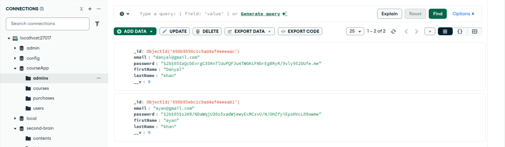
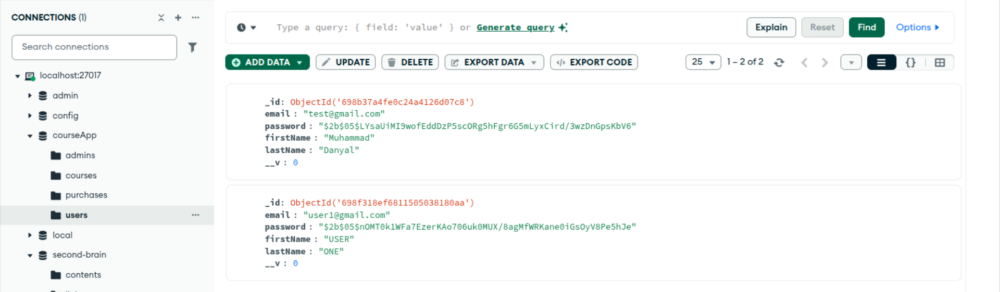
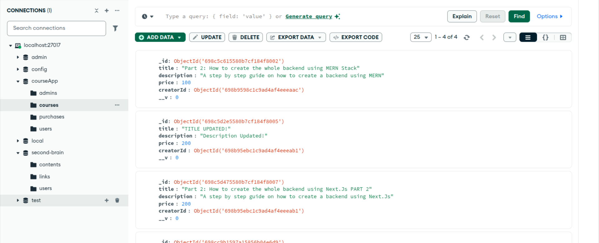
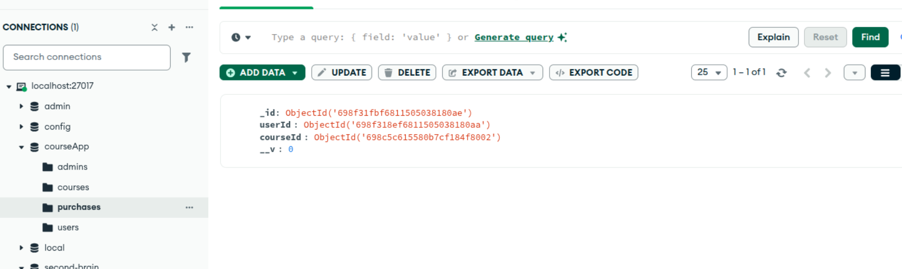

# Course Selling Platform 🎓

A full-stack course selling platform inspired by modern e-learning systems like Udemy. This application allows instructors to create and manage courses while students can browse, purchase, and access learning content in a structured and secure environment.

## 🚀 Purpose

The goal of this platform is to provide a scalable and secure backend system for selling online courses. It enables:

- Instructors to create and manage courses
- Students to browse and purchase courses
- Secure authentication and authorization
- Structured course content delivery

## 🏗 How It Works

1. Users register and log in securely using JWT authentication.
2. Admin/Instructors can:
   - Create courses
   - Add course details and content
   - Manage their published courses
3. Students can:
   - Browse available courses
   - Purchase courses
   - Access enrolled course content
4. The system ensures role-based access control (RBAC) so that only authorized users can perform specific actions.

## 🔐 Features

- JWT-based Authentication
- Role-Based Access Control (Admin / Student)
- Course creation and management
- Secure API endpoints
- RESTful architecture
- MongoDB data modeling

## 🛠 Tech Stack

**Backend**
- Node.js
- Express.js
- MongoDB
- Mongoose
- JSON Web Tokens (JWT)
- TypeScript (if used)

## 🎯 Project Objective

To design and implement a production-style backend system for an online course marketplace, focusing on security, scalability, and clean architecture.

This project demonstrates backend system design, authentication handling, and database modeling for real-world applications.

## admin schema

## Normal users/ Students schema

## courses schema

## purchases schema
